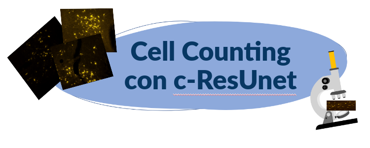
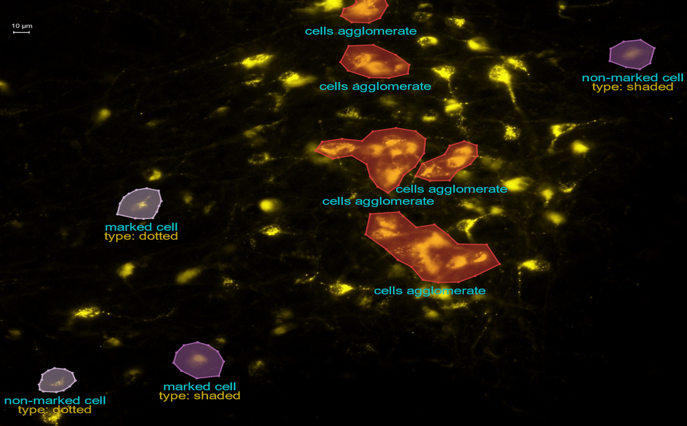
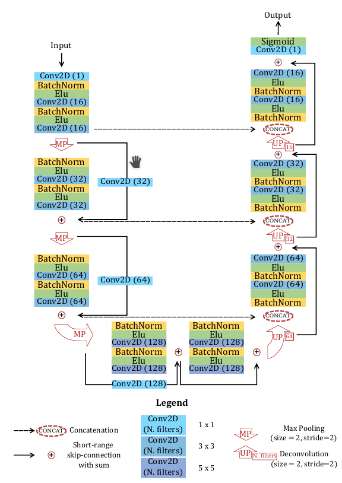
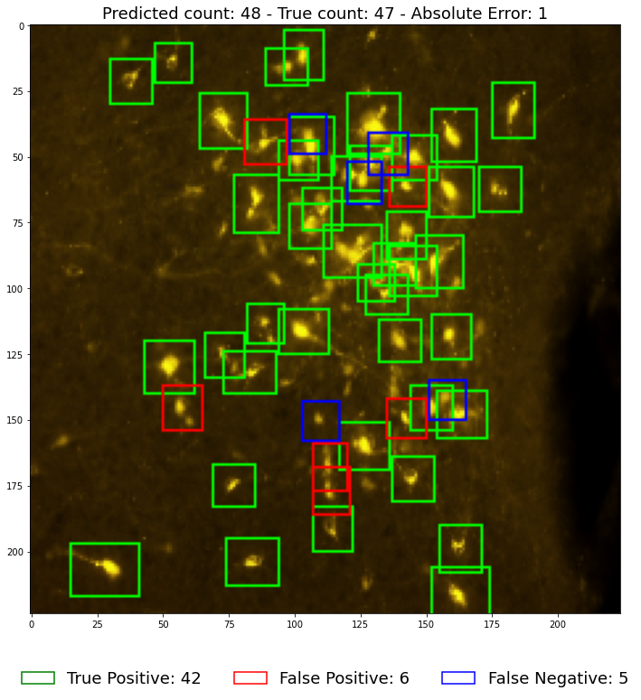

# Cell counting con c-ResUnet
### Deep Learning per riconoscere e contare automaticamente oggetti in immagini.

Il conteggio di oggetti è un task di learning diffuso in diverse applicazioni, dalla videosorveglianza all’agricoltura 4.0, passando per studi di biologia e medicina.
Tuttavia, spesso questo compito viene condotto manualmente da operatori umani, diventando molto oneroso in termini di tempo e risorse, e aumentando il rischio di errori di distrazione o affaticamento.
In questo corso vedremo come automatizzare riconoscimento e conteggio di oggetti in immagini tramite una architettura di rete neurale detta [c-Resunet](https://rdcu.be/cB1Ds), prendendo in esame il [Fluorescent Neuronal Cells dataset](http://amsacta.unibo.it/6706/).

## Moduli 1 e 2: Introduzione e Dataset

Dopo una panoramica generale sui possibili approcci al problema, presenteremo nel dettaglio il nostro use-case e le sfide che lo contraddistinguono. 
In particolare, vedremo come il task è complicato da **i)** *sbilanciamento tra pixel di sfondo e oggetti di interesse*, **ii)** *aree affollate*, **iii)** *etichette rumorose* e **iv)** *artefatti*.
Procederemo poi con delle analisi esplorative per prendere confidenza con i dati e con gli strumenti software che utilizzeremo.

[Immagine](http://amsdottorato.unibo.it/10016/1/thesis_CLISSA_DSC.pdf) da [Luca Clissa](https://www.linkedin.com/in/luca-clissa-b3908695/) su [AMS Dottorato](http://amsdottorato.unibo.it/10016/)

## Modulo 3: Analisi dati

Nel secondo modulo presenteremo 2 soluzioni per il nostro problema, presentando prima le basi teoriche su cui poggiano e poi testandole in pratica.
Inizieremo con l’implementazione di tecniche di imaging classico che utilizzano un filtro adattivo, che useremo poi come baseline per un approccio basato su Deep Learning.
In particolare, inquadreremo il problema come un task di segmentazione semantica a 2 classi, sfruttando delle *Convolutional Neural Network (CNN)*. Introdurremo quindi gli elementi principali che contraddistinguono le CNN e presenteremo 3 architetture pensate specificamente per questo compito: *Unet, ResUnet e c-ResUnet*.
Nella parte **hands-on** vedremo come implementare la c-ResUnet attraverso la libreria fastai e condurremo degli esperimenti con 3 loss function diverse: *Binary Cross Entropy, Focal loss e Dice loss*.

[Immagine](https://media.springernature.com/lw685/springer-static/image/art%3A10.1038%2Fs41598-021-01929-5/MediaObjects/41598_2021_1929_Fig2_HTML.png?as=webp) da [Automating cell counting in fluorescent 
microscopy through deep learning with c-ResUnet](https://rdcu.be/cB1Ds)

## Moduli 4 e 5: Valutazione e Conclusioni

Discuteremo poi di come strategie alternative di valutazione dei risultati risaltino aspetti diversi, ciascuna coi suoi pregi e con i suoi difetti.
Sfrutteremo quindi strategie diverse in maniera complementare per una valutazione a tutto tondo, cominciando da una **ispezione visiva** e continuando con **metriche** più quantitative **per segmentazione, detection e counting**. 

Per concludere, utilizzeremo tutti questi elementi per mettere in risalto i punti di forza e i limiti della soluzione proposta, delineando infine alcuni spunti per raffinare i risultati ottenuti.

## Esame

Alla fine avrete tutti gli strumenti per adattare quanto imparato ai vostri use-case, e l’esame sarà il vostro turno per mettervi alla prova! 
Proprio come in una applicazione reale, vi sarà richiesto di provare a migliorare i risultati sfruttando una loss diversa, che combina i punti di forza di quelle viste durante le lezioni.
Vi basterà quindi implementare la loss e replicare quanto visto durante il corso per gli esperimenti e la valutazione dei risultati.

